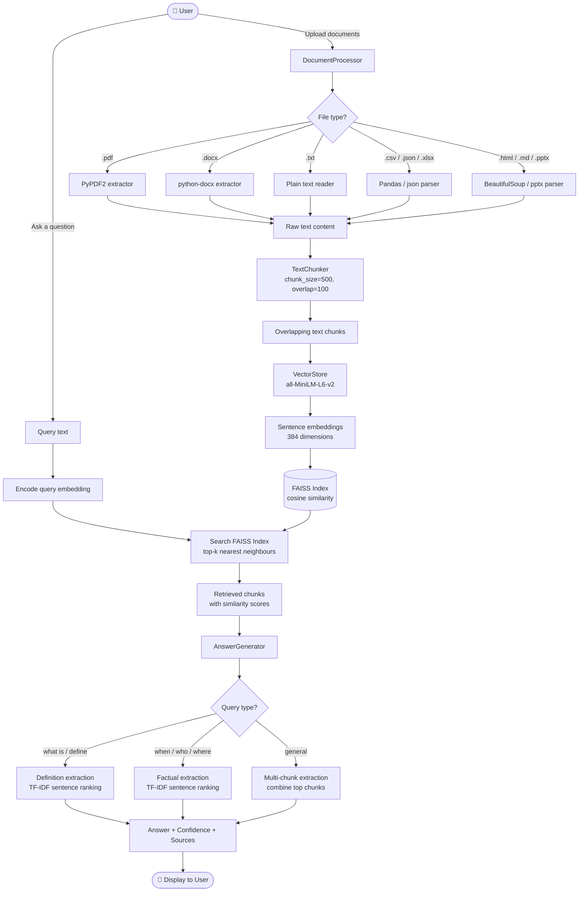

# RAG-based Document Question Answering System (No LLM)

A Retrieval-Augmented Generation system that answers questions from uploaded documents using **vector similarity search** and **extractive answer construction** - no generative AI involved.

## Features

- 📄 **Multi-format support**: PDF, DOCX, TXT, CSV, JSON, Excel (XLSX/XLS), PowerPoint (PPTX), HTML, Markdown
- 🔍 Vector-based semantic search using sentence transformers
- 📝 Extractive answer generation (no LLM hallucinations)
- ⚡ Fast retrieval with FAISS indexing
- 🎯 Relevant chunk highlighting with similarity scores

## Supported Document Formats

| Format | Extension | Description |
|--------|-----------|-------------|
| PDF | `.pdf` | Portable Document Format |
| Word | `.docx` | Microsoft Word documents |
| Text | `.txt` | Plain text files |
| CSV | `.csv` | Comma-separated values |
| JSON | `.json` | JSON data files |
| Excel | `.xlsx`, `.xls` | Microsoft Excel spreadsheets |
| PowerPoint | `.pptx` | Microsoft PowerPoint presentations |
| HTML | `.html`, `.htm` | Web pages |
| Markdown | `.md` | Markdown documents |

## How It Works

1. **Document Upload**: User uploads PDF or TXT files
2. **Chunking**: Documents are split into semantically meaningful chunks
3. **Embedding**: Chunks are converted to vector embeddings using sentence transformers
4. **Indexing**: Vectors are stored in FAISS for fast similarity search
5. **Question**: User asks a question
6. **Retrieval**: System finds most similar chunks via cosine similarity
7. **Answer Construction**: Extractive methods combine retrieved chunks into an answer

## System Flow Diagram



## Installation

```bash
pip install -r requirements.txt
```

## Usage

```bash
python main.py
```

Then:
1. Upload your documents (PDF, DOCX, TXT, CSV, JSON, Excel, PowerPoint, HTML, Markdown, etc.)
2. Ask questions
3. Get extractive answers from your documents

## Architecture

- `document_processor.py`: Multi-format document parsing (PDF, DOCX, CSV, JSON, Excel, PowerPoint, HTML, Markdown, TXT)
- `chunker.py`: Text chunking strategies
- `vector_store.py`: Embedding and FAISS indexing
- `retriever.py`: Similarity search
- `answer_generator.py`: Extractive answer construction
- `main.py`: CLI interface

## Example

```
> Upload document: research_paper.pdf
✓ Processed 45 chunks

> Question: What is the main conclusion?
📍 Answer (based on 3 relevant chunks):
The study concludes that... [extracted from document]

Confidence: 0.87
Sources: chunks 12, 23, 34
```
